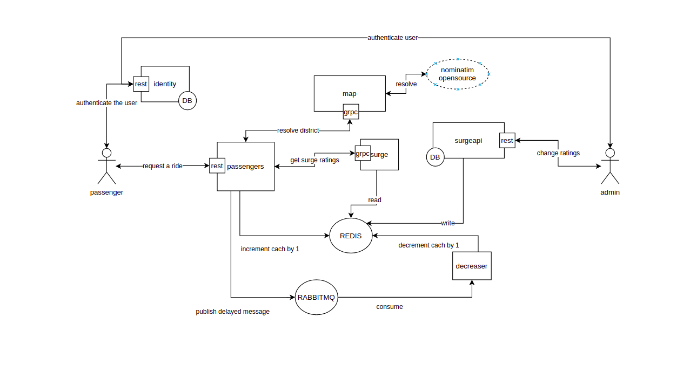

# Introduction

This project tries to create a solution for high load demand surges in a taxi as a service provider platform like uber.  
This is a proof of concept and is not intended to be used in production.

# How to run and use the project

I have dockerized the project and you can run it with the following commands(you must have installed git, docker and docker-compose before running these commands):

```
$ git clone git@github.com:usefss/cab-please.git
$ cd cab-please
$ docker-compose build
$ docker-compose up -d
```

Now to interact with the identity service and create a new user and obtain tokens you can use the swagger ui exposed at [this url](http://localhost:8080/swagger/index.html).  
And you can interact with the passenger service to request a ride and see the calculated surge rates, using the swagger ui exposed at [this url](http://localhost:8081/swagger/index.html).  
And finally as an admin user you can interact with the surge rating API, suing the swagger ui exposed at [this url](http://127.0.0.1:8000/api/schema/swagger/).  

# Software architecture

The mind map and the concepts I have put together to create the finanl output.    

We start from the simplest possible thing, `someone needs a cab` and `someone is a cab`. There are many many people demanding a cab and many cabs offering their services. We want a very very very minimal and simple solution, ignoring the distances, destination, user experience and other things.  

Here I have demonstrated a normal not-realtime HTTP based process for requesting a cab.


Probably, when the cab reaches the pessanger, the system will set the demand status to `in-journey` and when they reach the destination, the system will set the demand status to `completed`, we do not need to achieve these at this time.   
Infact we are going to investigate just step 1, and step 2. The problem is that sometimes demand is so much higher than the number of cabs available. for example we can only service around 100 people in a hour, but demand is beyond that number, also we can conclude that if we are that much popular and there are so much demands, we can somehow make more money.  
The proposed solution to this problem is getting a higher fee for the exact demand, with the exact joureny, so this will lead to less people using our service in short terms, hence flattening the surge in demands in this short time peroid, also it will cause more caps register into our product because of high wage in long terms.   

How to implement it?  
We just need to check how many demands are created in last one hour, and if the number is higher than the threshold, we will multiply the journey cost by the rate specified.  
It is clear that executing a query for each demand to calculate the surge rate, is not practical, so I thought of two approaches: 
1. Cache the number of demands with a short time life span, for example we query the database and cache into redis for one minute, and surge service calculates the rating from this value, after one minute it will be refreshed hence old demands will be removed and new ones will be added, one problems is that this is not so much realtime, if we have a surge of demands in under one minute, we will not be able to detect it.  
2. More realtime aproach, we can cach the number of demands in redis on service startup, and each new demand will increase the cach value by +1, and after one hour, we will decrease the cach value by -1, hence the value is realtime and surge rating is calculated very precisely.   

Aproach one doesn't requrie much resources, but aproach two uses a time queue to decrease the cached values, for example, if we have one milion demands in a time span of one hour(worst case scenario, not going to happen very soon), there will be almost one milion `decrease by one after one hour` messages in the queue, the worst possible thing can happen is that you will need about `one or two` extra GIGs of RAM.  
A small note about the aproach two is that, because there maybe old messages on the queue, the worker that consumes the decrease messages must does the message only if it is created after the timestamp of the cached value, otherwise it will be ignored, to assure the inconsistency.  
Also we must check if one unique user is trying to create many demands in a short time, if so, we will not change the cached demand count.  


And we need a service to resolve the geographical location of the client into the real life district name or district id, so we are going to open street map, nominatim api to obtain these information.  
Also we need a user management service that will handle authentication of our clients.  
The primary system design:  


I had came up with an idea to change and manage surge ratings in a persistant and realtime way, so admins can interact and change ratings using a rest api, and with each change the system will push the change to the redis cache and the surge service will calculate the new ratings.  
The final system design schema:



## Resources

Here are some usefull links:  
- [Understand OSM data models.](https://wiki.openstreetmap.org/wiki/Elements)  
- [Tehran OSM relation.](https://www.openstreetmap.org/relation/6663864#map=12/35.7398/51.4933)  
- [Go gin framework.](https://github.com/gin-gonic/gin)  
- [Gorm ORM.](https://github.com/go-gorm/gorm)  
- [Writing a simple API with gin and gorm.](https://blog.logrocket.com/how-to-build-a-rest-api-with-golang-using-gin-and-gorm/)  
- [Adding swagger support to gin.](https://github.com/swaggo/swag)  
- [Using viper for environment files.](https://github.com/spf13/viper)  
- [Hash user passwords in database.](https://pkg.go.dev/golang.org/x/crypto/bcrypt)  
- [JWT tokens in golang.](https://github.com/golang-jwt/jwt)  
- [Wrting a middleware for gin.](https://sosedoff.com/2014/12/21/gin-middleware.html)  
- [Wrting tests in golang.](https://www.digitalocean.com/community/tutorials/how-to-write-unit-tests-in-go-using-go-test-and-the-testing-package)  
- [Use nominatim to resolve the location of the client.](https://nominatim.org/release-docs/develop/api/Reverse/)  
- [How to use GRPC?](https://tutorialedge.net/golang/go-grpc-beginners-tutorial/)  
- [Working with Redis.](https://github.com/go-redis/redis)  
- [RabbitMQ delayed exchange.](https://blog.rabbitmq.com/posts/2015/04/scheduling-messages-with-rabbitmq)  

